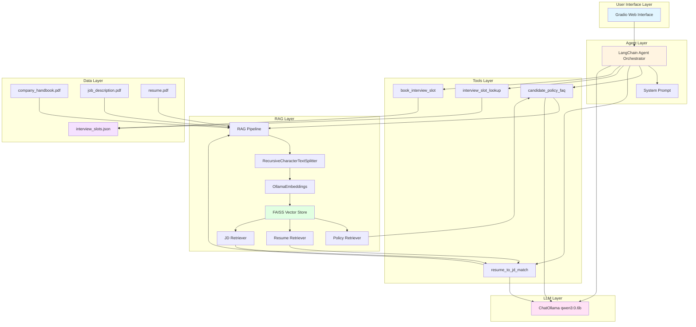
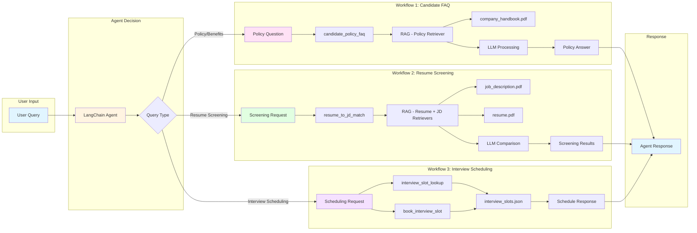

# Hiring & Onboarding Agent

## About the Project
The **Hiring & Onboarding Agent** is an AI-powered recruitment assistant designed to streamline the hiring process and assist with employee onboarding. It acts as an intelligent assistant capable of answering questions, screening candidates, and managing interview schedules. 

The agent operates through a Gradio-based user interface and is driven by an underlying Large Language Model (LLM). To maintain high accuracy and relevance, the system is designed with strict data separation across its core functionalities.

The agent features three entirely distinct workflows:
1. **Candidate FAQ**: Answers candidate or employee questions regarding company policies, employee benefits, leave, holidays, working hours, insurance, etc., by referencing a company handbook.
2. **Resume Screening**: Analyzes a candidate's resume against a job description to determine matching skills, missing skills, and overall candidate qualifications/experience.
3. **Interview Scheduling**: Manages available interview slots, allowing users to query dates and times and book interviews via a mock calendar system.

## System Architecture
The system is built using modern AI and framework technologies, including **LangChain**, **Ollama**, **FAISS**, and **Gradio**. 

The architecture is broken down into the following key components:
- **LLM Engine (`demo.py`)**: Uses `ChatOllama` to instantiate the core language model (e.g., `qwen3:0.6b`).
- **Retrieval-Augmented Generation (RAG) (`rag.py`)**: Responsible for document processing. It ingests PDF documents (`company_handbook.pdf`, `job_description.pdf`, `resume.pdf`), chunks the text using `RecursiveCharacterTextSplitter`, creates embeddings using `OllamaEmbeddings`, and stores them locally in a `FAISS` vector store. It also defines custom retrievers for specific document types (policy, resume, jd).
- **Custom Tools (`tool_calls.py`)**: Implements the logic for specific actions such as `resume_to_jd_match` (screening), `interview_slot_lookup` (calendar lookup via `interview_slots.json`), and `book_interview_slot`.
- **Agent Orchestrator (`agent.py`)**: Connects the LLM, the tools, and the RAG pipelines using LangChain's agent framework. It uses a strict system prompt to ensure that the agent uses the correct tool and data source for the requested workflow (e.g., policy queries only search the handbook, screening only uses the resume and JD).
- **User Interface**: Provided by `Gradio`, allowing users to interact with the agent through a conversational markdown-supported chat interface.

### System Architecture Diagram



### Workflow Diagram



## Conclusion & Usefulness```

## Conclusion & Usefulness
This project is highly useful for HR departments, recruiters, and hiring managers as it automates several time-consuming administrative tasks. 

By employing an agentic AI approach with RAG capabilities, the system provides several key benefits:
* **Efficiency**: It can instantly extract relevant policy information without requiring an HR representative to search through a lengthy handbook.
* **Objective Screening**: The agent provides rapid, unbiased comparisons between a candidate's resume and a job description to quickly surface matched or missing skills.
* **Automated Scheduling**: Eliminates the back-and-forth emails usually required for scheduling interviews by handling slot lookups and bookings natively.
* **Data Privacy/Separation**: The architecture's strict separation of concerns ensures that candidate screening data isn't accidentally mixed with company policy data, leading to a highly reliable assistant.
